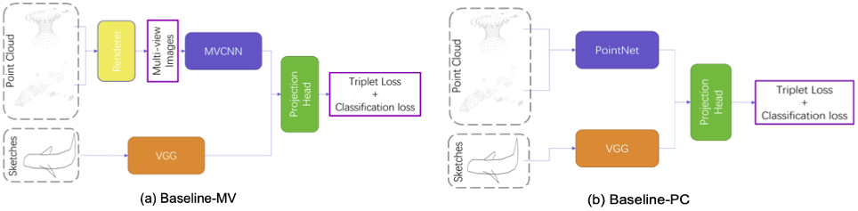

## **[SHREC 2022](http://www.google.com/url?q=http%3A%2F%2Fwww.shrec.net%2F&sa=D&sntz=1&usg=AOvVaw3ig8bD6ChvnwYhTkC_hLXm)** Track: Sketch-Based 3D Shape Retrieval in the Wild

[[homepage](https://sites.google.com/site/firmamentqj/sbsrw)] [[paper](http://arxiv.org/abs/2207.04945)] [[datasets](https://drive.google.com/drive/folders/1vsIxSx3UAYOB84UddCRFRnnm0N49Q4xr)]

Organizers: [Jie Qin](https://sites.google.com/site/firmamentqj/), [Shuaihang Yuan](https://shalexyuan.github.io/), [Jiaxin Chen](https://scholar.google.pl/citations?user=eNlGf7EAAAAJ&hl=en), [Boulbaba Ben Amor](https://sites.google.com/site/bbenamorshomepage1/), [Yi Fang](https://scholar.google.com/citations?user=j-cyhzwAAAAJ&hl=en).


### News

- 09/03/2022: We have announced the final results.
- 28/02/2022: We have released the test sets at [[Google Drive](https://drive.google.com/drive/folders/1vsIxSx3UAYOB84UddCRFRnnm0N49Q4xr?usp=sharing)].
- 16/02/2022: We have released the evaluation code at [[Google Drive](https://drive.google.com/file/d/1q4UyvH4Rqiekvj3n0LI0Y0fjz9ZxtZML/view?usp=sharing)] as well as the test protocol (see below).
- 05/02/2022: We have released the training set for the second task at [[Google Drive](https://drive.google.com/drive/folders/17FqklbpYLszNAWNzeXn-JDLrn-v_lkJh?usp=sharing)].
- 29/01/2022: We have released the training set for the first task at [[Google Drive](https://drive.google.com/drive/folders/1iEP41h83ja3HVAY-E_q3-FI-WtsugjYP?usp=sharing)].
- 15/01/2022: A few sample sketches (100 per category) and 3D models (10 per category) are released at [[Google Drive](https://drive.google.com/drive/folders/1Hock5jQiObq8xaji0MGYt2JTqlcDXMt7?usp=sharing)] [[Baidu Netdisk](https://www.google.com/url?q=https%3A%2F%2Fpan.baidu.com%2Fs%2F1RiJ-8d6k7Wx2P2UoSDfUtQ%3Fpwd%3Dta7z&sa=D&sntz=1&usg=AOvVaw3g7cNh1Rs3X-D1LCrZQk9C)].


### Datasets

Visit our [google-drive folder](https://drive.google.com/drive/folders/1vsIxSx3UAYOB84UddCRFRnnm0N49Q4xr) for all data:

+ [CAD](https://drive.google.com/drive/folders/1iEP41h83ja3HVAY-E_q3-FI-WtsugjYP?usp=sharing), [WILD](https://drive.google.com/drive/folders/17FqklbpYLszNAWNzeXn-JDLrn-v_lkJh?usp=sharing), [Samples](https://drive.google.com/drive/folders/1Hock5jQiObq8xaji0MGYt2JTqlcDXMt7?usp=sharing).

### Baseline Methods:



## Run

### Set up Env
```shell
conda env create -f environment.yml
```

### Download Dataset

Download all the files from our [google-drive](https://drive.google.com/drive/folders/1ehIBQG-2C3RHGkJvoBzXTiJNd3xZpbTA) and put them into `SBSRW/dataset`.

#### Training

##### Baseline-MV

```shell
cd mv
./shrec22_script/train_mv_cad.sh
./shrec22_script/train_mv_wild.sh
```

##### Baseline-Point (Baseline-PC)

```shell
cd point
./shrec22_script/train_pc_cad_01.sh
./shrec22_script/train_pc_wild_01.sh
```

Checkpoints of baselines can be found [here](https://drive.google.com/drive/folders/1B5fE20eE078SWEE1HHKgxgNdyr2QW6rV?usp=sharing).

#### Test

##### Baseline-MV

```shell
cd mv
./shrec22_script/test_mv_cad.sh
./shrec22_script/test_mv_wild.sh
```

##### Baseline-Point (Baseline-PC)

```shell
cd point
./shrec22_script/test_pc_cad_01.sh
./shrec22_script/test_pc_wild_01.sh
```

#### Evaluation & plots
Download the GT files from the same [google-drive folder](https://drive.google.com/drive/folders/1ehIBQG-2C3RHGkJvoBzXTiJNd3xZpbTA) and set their paths correctly in notebook.

Download the pretrained weights from our release, then
```shell
mv  checkpoints/checkpoint_mv mv/checkpoint
mv  checkpoints/checkpoint_point point/checkpoint
```

Check the `3d_sketch_eval.ipynb` or the online [colab](https://colab.research.google.com/drive/1Baon_b4QAE3kL-RpQDbgaFdu9T8rkInH#scrollTo=G2Y24ZE8s0lM).

> Due to the large file of results provided in Task-1 (MV), the program will cost about 11GB RAM, which is a little bit lower than that of the free accounts.


### Leaderboard

> For a comprehensive evaluation of different algorithms, we employ the following widely-adopted performance metrics in SBSR, including nearest neighbor (NN), first tier (FT), second tier (ST), E-measure (E), discounted cumulated gain (DCG), mean average precision (mAP), and precision-recall (PR) curve. We will provide the source code to compute all the aforementioned metrics.

| Task #1 (%) |         |       |       |       |       |       |       |
| ----------- | ------- | ----- | ----- | ----- | ----- | ----- | ----- |
| Rank        | Team    | NN    | FT    | ST    | E     | DCG   | mAP   |
| 1           | HCMUS_2 | 92.23 | 86.96 | 92.77 | 49.04 | 95.4  | 90.18 |
| 2           | CCZU    | 2.35  | 1.94  | 3.92  | 0.36  | 38.16 | 2.23  |
| 3           | HIT     | 1.08  | 1.54  | 3.1   | 0.11  | 36.29 | 2.05  |

| Task #2 (%) |         |       |       |       |       |       |       |
| ----------- | ------- | ----- | ----- | ----- | ----- | ----- | ----- |
| Rank        | Team    | NN    | FT    | ST    | E     | DCG   | mAP   |
| 1           | HCMUS_2 | 71.16 | 61.29 | 71.81 | 25.18 | 86.18 | 67.31 |
| 2           | HCMUS_1 | 39.73 | 44.71 | 63.1  | 14.47 | 77.17 | 46.67 |
| 3           | HIT     | 10.93 | 11.13 | 20.58 | 3.86  | 60.18 | 15.15 |
| 4           | CCZU    | 10.23 | 9.85  | 19.52 | 3.08  | 58.75 | 10.09 |


### Contact

For more details, please contact [Prof. Jie Qin](https://sites.google.com/site/firmamentqj/).
